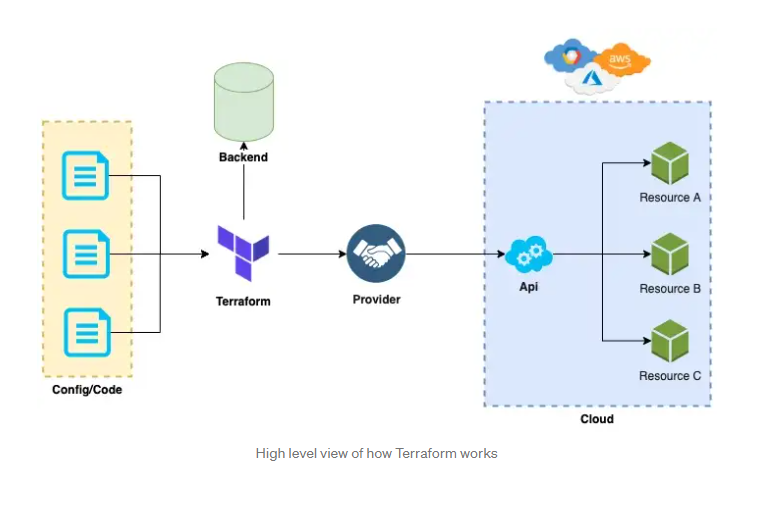
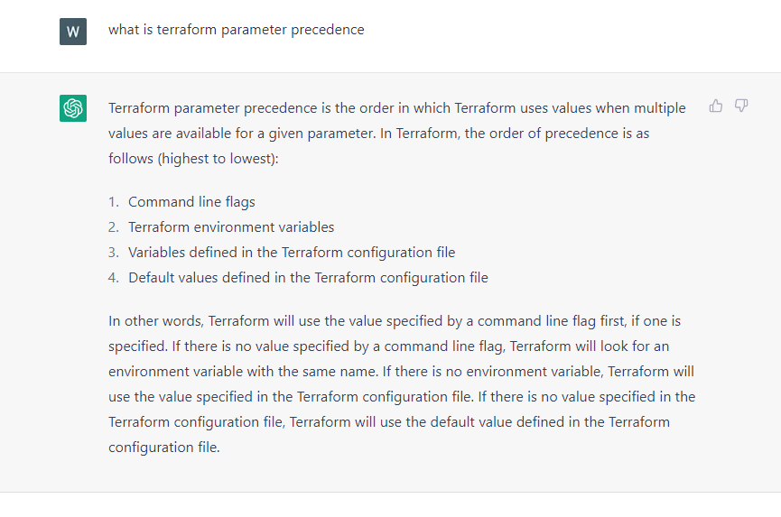

# Terraform from zero to VM in cloud

## IaaC tool developed by [Hashicorp](https://www.terraform.io/)


[](https://miro.medium.com/max/720/1*VaN9B7uOD8jQnwb4UidEBw.webp)

### Let's go dirty

### [Get terraform](https://developer.hashicorp.com/terraform/tutorials/aws-get-started/install-cli) 

Hint(add to your `.bashrc`):
```
alias tf=terraform
complete -C /usr/bin/terraform terraform
complete -C /usr/bin/terraform tf
```
### Create file!

```
cd 1_file/
terraform init
terraform plan

```
Here is an output you should get
```
Terraform used the selected providers to generate the following execution plan. Resource actions are indicated with the following symbols:
  + create

Terraform will perform the following actions:

  # local_file.foo will be created
  + resource "local_file" "foo" {
      + content              = "foo!"
      + directory_permission = "0777"
      + file_permission      = "0777"
      + filename             = "./foo.bar"
      + id                   = (known after apply)
    }

Plan: 1 to add, 0 to change, 0 to destroy.
```

```
terraform apply
```

```
Do you want to perform these actions?
  Terraform will perform the actions described above.
  Only 'yes' will be accepted to approve.

  Enter a value: yes

local_file.foo: Creating...
local_file.foo: Creation complete after 0s [id=4bf3e335199107182c6f7638efaad377acc7f452]
```

```
ls foo.bar
cat foo.bar 
```

```
terraform destroy
```

```
Terraform will perform the following actions:

  # local_file.foo will be destroyed
  - resource "local_file" "foo" {
      - content              = "foo!" -> null
      - directory_permission = "0777" -> null
      - file_permission      = "0777" -> null
      - filename             = "./foo.bar" -> null
      - id                   = "4bf3e335199107182c6f7638efaad377acc7f452" -> null
    }

Plan: 0 to add, 0 to change, 1 to destroy.

Do you really want to destroy all resources?
  Terraform will destroy all your managed infrastructure, as shown above.
  There is no undo. Only 'yes' will be accepted to confirm.

  Enter a value: yes

local_file.foo: Destroying... [id=4bf3e335199107182c6f7638efaad377acc7f452]
local_file.foo: Destruction complete after 0s
```


### Use variables

```
cd 2_variables
tf init
tf plan
tf apply
tf destroy
```

### Sensitive variables + parameters precedences

```
cd 2_variables/vars_sensitive
tf init
tf plan
```
```
var.file_content
  Enter a value: 
  ```
```
tf plan -var-file="secret.tfvars"
tf apply -var-file="secret.tfvars"

tf destroy
```
```
var.file_content
  Enter a value:
  ```
```
tf destroy -var-file="secret.tfvars"
```

### Parameters precedences



### How to split dev/test/...
In native Terraform way, by the workspaces

```
cd 3_environments/workspaces
terraform workspace new dev
```
```
tf workspace list
  default
* dev
```

```
resource "local_file" "foo" {
  content  = "foo!"
  filename = "${path.module}/file.${terraform.workspace}"
}
```
```
tf init
tf plan
tf apply
```

```
ls file.dev
```
```
terraform workspace select default
```
```
tf plan && tf apply
```
```
ls file.default 
```

```
tree  terraform.tfstate.d/
```

```
terraform.tfstate.d/
└── dev
    └── terraform.tfstate
```

### Environments variable split
```
cd 3_environments/file_structure/
cd dev
tf init
tf plan 
tf apply 
```

```
Terraform will perform the following actions:

  # module.web_app.local_file.foo will be created
  + resource "local_file" "foo" {
      + content              = "foo!"
      + directory_permission = "0777"
      + file_permission      = "0777"
      + filename             = "/mnt/c/Users/waw/OneDrive/Documents/repos/terraform_intro/3_environments/file_structure/dev/dev.file"
      + id                   = (known after apply)
    }

Plan: 1 to add, 0 to change, 0 to destroy.
```


### Into the Cloud - let's make vm
```
cd 4_azure_vm
az login
tf init
tf plan
```
```
tf plan -var "admin_password=password1234!"
tf apply -var "admin_password=password1234!"

tf output
```

## What next?

### Why tfstate is important? Remote backend, ways to do it.

### If you want to learn more about Terraform watch:
https://youtu.be/7xngnjfIlK4

checkout:
https://github.com/sidpalas/devops-directive-terraform-course

### Terraform Language Documentation - https://developer.hashicorp.com/terraform/language

### TF_LOG=debug